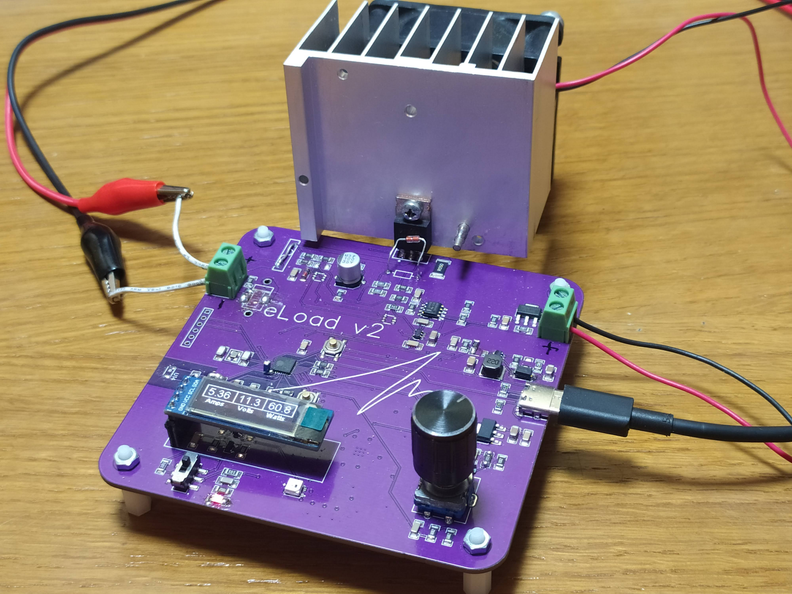
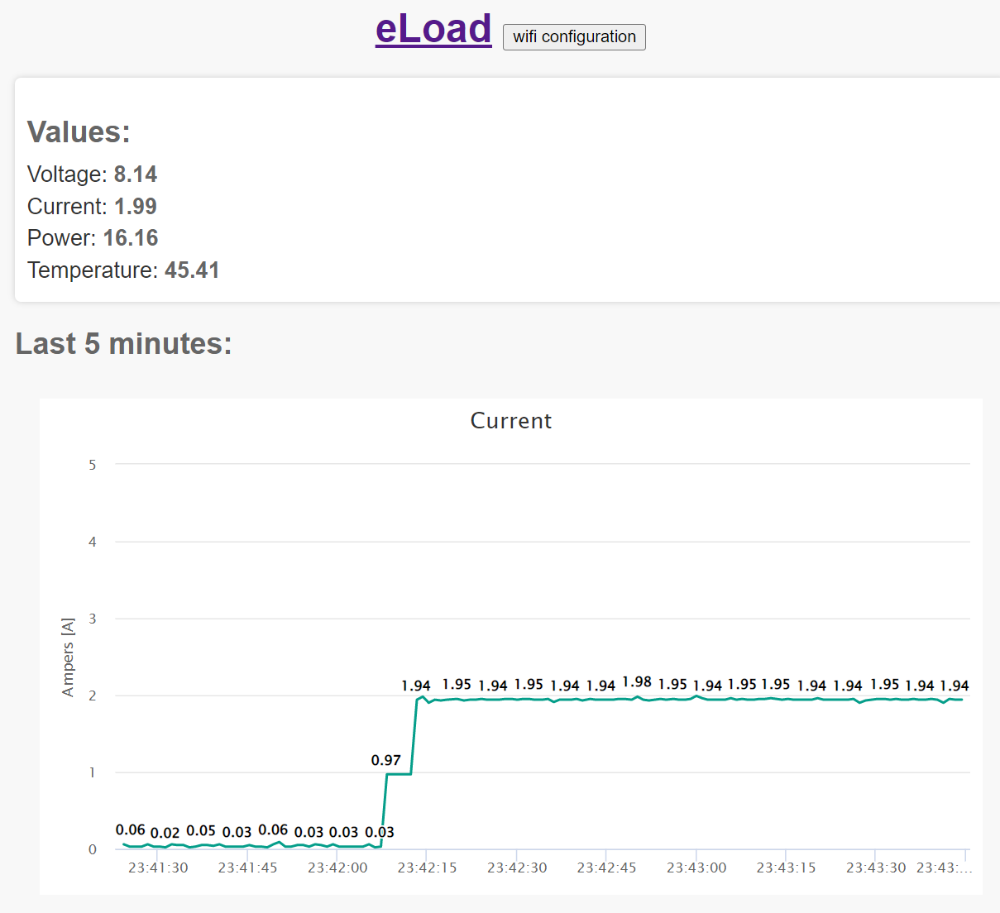

# Electronic Load - 60W

___In development___

This is a DIY project aimed at providing a practical, useful  and safe electronic load for people interested in electronics. While it is not be the most powerful electronic load available, it is designed to be easy to use and reliable, making it an excellent option for those looking for a DIY electronic load. We develop a HW and SW for complete integration, but you can pick up just on of them. Based in microcontroller ESP32-C3

## Features

The __Electronic Load - 60W__ has several features that make it a practical and useful tool, including:

- __25Vdc__ maximum voltage
- __5A__ maximum current
- __60W__ power output (_12V/5A_, depending on cooling system)
- Based in microcontroller __ESP32-C3__
- Reverse polarity voltage protection
- __Thermal protection__ to prevent avalanche breakdown due to temperature
- Overcurrent and overvoltage protection
- Adjustable current, voltage and power settings by fisical selector
- Switch to dis/enable load functions
- Easy-to-read display for current, voltage and power monitoring
- Easy-to-configure wifi _ssid_ and _psk_
- __Live graphic on web__ for current, tension and power monitoring
- Cooling fan output, 12Vdc/0.5A
- It is powered by a typical 5V USB-C power source

## Purpose

This project is designed for people who want to build their own electronic load for testing and evaluating power supplies, batteries, and other electronic components. It is a practical and affordable solution for those who do not want to spend a lot of money on a commercial electronic load but still want to have a reliable tool for their electronic projects.

## GPIOs
|Function|GPIO|Mode|
|---|---|---
|Cooling fan|0|Output|
|ADC-Isense|1|Input|
|Digital led|2|Output|
|ADC-Vsense|3|Input|
|ADC-Tsense1|4|Input|
|Mosfet|6|Output|
|Sw sense|7|Input|
|Selector move B|8|Input|
|Selector button|9|Input|
|Selector move A|10|Input|
|I2C-SCL|20|Communication for oled|
|I2C-SDA|21|Communication for oled|

## Safety

Safety is a top priority in the design of the __Electronic Load - 60W__. It includes HW and SW protections:
__HW__
- Resettable fuse of 6A, for overcurrent of load
- Thermoswitch, 
- Opam,
- Main switch
- Thermistor sensor, 
- Fan

__SW__
- Thermistor monitoring for turn on the fan when temperature increase over 50ºC and turn of pwm signal when it is over 100.

overcurrent and overvoltage protection, and is designed to be safe and reliable for DIY enthusiasts.

## Accuracity
It is the weak point of the ESPRESSIF microcontrollers, the internal ADC it is not accurate. In my tests, the error can be up to 10% of error, and it can change in the time. In HW design exist de option the use an external ADC for monitor Voltage and Current (not for temperature). As 

## Conclusion
The Electronic Load - 60W is a great DIY project for those interested in electronics. It is practical, reliable, and safe, making it an excellent tool for testing and evaluating power supplies, batteries, and other electronic components.

## To do
- Adjustable current, voltage and power settings by web
- Get log file .csv, via web, sd card or usb to pc
- Pograming changing load in time
- Batteries calculations
- Design of 3D printable box
- Create an easy configuration file
- Comment all code
